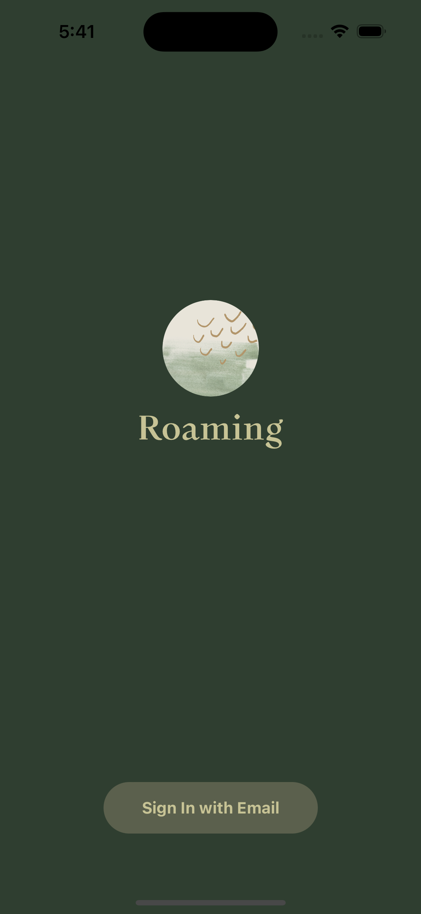

# Roaming - A Travel Journal App  

Roaming is a visual storytelling app that encourages users to capture raw, aesthetic moments and create a digital footprint of their experiences. Unlike traditional photo-sharing platforms that emphasize selfies and social engagement, Roaming is designed to document places, landscapes, cityscapes, and nature, allowing users to tell stories through their surroundings rather than themselves.

Whether it's a bustling city skyline, a quiet morning in nature, or a unique architectural detail, Roaming helps users focus on capturing the world around them rather than posing for the camera. By taking and uploading photos that showcase atmosphere, environment, and emotion, users build a personal visual diary that reflects the places they've been and the moments they've witnessed.

With no likes, no follower counts, and no pressure, Roaming is an invitation to slow down and appreciate the beauty in everyday life—one photo at a time.

---

## Technologies Used  

- **React Native**: a framework for building mobile applications using JavaScript and React, allowing developers to create cross-platform apps for iOS and Android with a single codebase.
- **Expo**: a framework and platform built on top of React Native that simplifies development by providing pre-configured tools, libraries, and a managed workflow to streamline the process of building and deploying mobile apps.

---

## Current Features  

### Welcome Screen  
- Displays the app logo and name  
- Includes a "Get Started" button that navigates to the home screen  

### Home Screen  
- Displays a main feed with placeholder content  
- Implemented with FlatList for scalable and efficient content loading  

### Create a post
- Allow user to select at most 10 pictures to upload and write post description
- Allow adding user's current location
- Allow using the user's camera to capture image

---

## Future Enhancements  

- User Authentication – Allow users to sign in and store their travel logs securely  
- Location Mapping – Pin visited places on an interactive map  
- Multi-language Support – Expand accessibility for a global audience  

---

## Screenshots  

### Welcome and Home
<div>   </div>

### Upload Post 
<div>  </div>


---

## Installation & Setup  

Clone the Repository  
```sh
git clone https://github.com/your-username/roaming-app.git
cd roaming-app
```
Install Dependencies
```sh
npm install
```
Run the Expo Development Server
```sh
npx expo start
```
